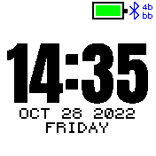

# flurl Clock

A fork of Anton Clock adding shortcuts for opening apps.
V0.1 let you define 6 apps you can open directly from the clock. Possible triggers are:
- tap
- double tap
- swipe up
- swipe down
- swipe left
- swipe right

V0.2 adds actions for controlling media players on the phone.

## Settings

You can change settings by going to the global `Settings` app, then `App Settings`
and `flurl Clock`:

- `1st/2nd/3rd/4th/5th/6th App` - Assign apps to actions
- `Tap` - Action to be taken when tapping on the display
- `Double Tap` - Action to be taken when double tapping on the display
- `Swipe Left/Right/Up/Down` - Action to be taken when swiping in the corresponding direction
- `Double Tap Delay` - Maximum delay in milliseconds for recognizing the second tap

## Images
_1. Screenshot of the clock_

## Creator

Florian Klug

## Attributions

Icons used in this app are from https://icons8.com
